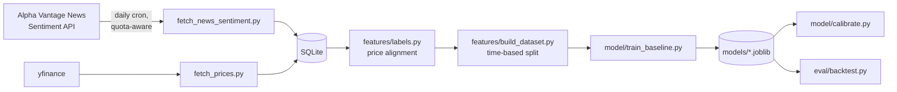

# Market Impact Predictor

Given a financial news event, predict the direction, magnitude, and
calibrated confidence of the stock price move that follows it. Builds on
[fin-event-intel](../fin-event-intel)'s event/entity extraction work, but
needs its own historical dataset — a live feed only teaches a model what
happens *after* you start running it, never what happened before.

## Highlights

- **Caught a costly wrong assumption about a third-party API before it
  compounded.** Assumed Alpha Vantage's multi-ticker query was an OR
  filter; it's actually an AND ("articles mentioning ALL listed tickers
  simultaneously"), which silently returned near-empty results and burned
  20 of a 25/day quota before the pattern was obvious enough to question.
  Redesigned around single-ticker calls once caught. ([details](#m1-lesson-verify-api-semantics-before-designing-around-them))
- **Every stage refuses to produce a misleading number on too little
  data**, rather than reporting a number that looks like a result but
  isn't one. M4 trained on 15 examples and got a majority-class
  collapse (expected, and said so); M5 and M6 declined to run at all,
  explicitly, below a 30-example floor.
- **Time-based train/test split, not random** — a random split on
  time-series financial data lets the model implicitly train on
  information from the future relative to a test example, which makes
  a backtest look better than any live version of the model ever could.
- **The backtest ships with its own caveats printed alongside the
  numbers** — no transaction costs, hand-picked ticker universe,
  single historical period — rather than a clean-looking result someone
  has to know to distrust.
- **22 tests, all deterministic, none needing a trained model or live
  API** — including one that caught a real bug in its own mock (a test
  double returning a Python list where the real dependency returns a
  numpy array, which broke the code's `[:, 1]` slicing).

## Architecture



Two independent data sources (news+sentiment, and raw prices) feed the
same SQLite database; `features/labels.py` is the join point that turns
"an article about ticker X at time T" into "what actually happened to
X's price afterward" - everything downstream (dataset construction,
training, calibration, backtest) is standard ML pipeline shape once that
join exists.

## Quickstart

```bash
python -m venv .venv
source .venv/bin/activate
pip install -r requirements.txt
cp .env.example .env   # then fill in ALPHA_VANTAGE_API_KEY
```

**Collect data** (news backfill is quota-limited to ~23 calls/day free
tier - runs incrementally, resumable, via a daily cron job):
```bash
python -m src.ingest.fetch_news_sentiment   # news + sentiment, quota-aware
python -m src.ingest.fetch_prices           # prices, no rate limit
```

**Run the modeling pipeline** (safe to re-run any time - picks up
whatever data exists):
```bash
python -m src.run_pipeline
```

## Testing

```bash
python -m pytest tests/ -v
```

22 tests, all fast (~1s total), all deterministic - no live API calls,
no trained model required. Same philosophy as Project 1: test the logic
you actually own directly (date/price arithmetic, the time-based split,
the quota tracker's persistence and reset behavior, the backtest's
position-sizing logic against a mocked model), and don't try to unit-test
a live model's output quality - that's what the manual verification
against real data (see below) and the eventual calibration/backtest
metrics are for.

## Roadmap

- [x] M0 — repo scaffold
- [~] M1 — historical news+sentiment ingestion (Alpha Vantage, quota-aware) — in progress via daily cron, a few more days to finish the 1-year backfill
- [x] M2a — historical price data (yfinance, 14mo × 21 tickers)
- [x] M2b — price alignment → forward-return labels
- [x] M3 — dataset construction (time-based split, no lookahead leakage)
- [x] M4 — baseline model: direction classifier + magnitude regressor
- [x] M5 — confidence calibration (Brier score + reliability curve)
- [x] M6 — backtest evaluation (with honest limitations, not a hype number)
- [x] M7 — portfolio polish (tests, README, this list)

## Engineering notes

The rest of this README is the build log - what was tried, what broke,
what got measured, and why. Kept chronological rather than rewritten as
if everything worked first try.

### M1 lesson: verify API semantics before designing around them

Alpha Vantage's `tickers` parameter looked like it should batch multiple
tickers per call (`tickers=AAPL,MSFT,...`) to conserve the 25-calls/day
quota. It doesn't work that way - per AV's own docs, it's an AND filter
("articles that simultaneously mention" every listed ticker), not an OR.
Batching 5 unrelated tickers together asks for articles mentioning all
5 at once, which almost never happens - the first backfill run burned
20 of that day's 25 calls returning near-zero results before this was
caught. Redesigned around one ticker per call, quarterly time windows
instead of monthly to keep the total call count reasonable (~84 calls
for a year across 21 tickers). Lesson kept for the interview, not just
here: verify an unfamiliar third-party API's actual semantics with one
cheap call before designing a whole strategy around an assumption.

Quota protection is two layers, not one: a local JSON counter tracks
calls used per UTC day, but every response is also checked for Alpha
Vantage's own rate-limit signal (a 200 OK with an "Information" or
"Note" field, not an HTTP error code) as a hard backstop - trusting only
local bookkeeping felt too fragile after already miscounting once.

The backfill runs via a real OS cron job (`crontab`, not a cloud-scheduled
task), since the script needs the project's local venv, `.env`, and
SQLite file - none of which a cloud sandbox would have access to.
Setting it up correctly took several tries: cron doesn't start in the
project directory, so a first attempt with relative paths would have
silently failed every day. Caught by testing the *exact* installed
crontab line from a cold `$HOME` shell before trusting it unattended,
after (embarrassingly) writing the same broken relative-path version
five times in a row via inline shell variables - switching to writing
the line to a file and reading it back is what actually broke that loop.

### M2b: market-hours cutoff for price alignment

An article published during market hours has its reaction reflected in
that same day's close; one published after close (or on a weekend/
holiday) can't be reacted to until the next session opens. Getting this
backwards would mean using a closing price that occurred *before* the
news broke as if it already reflected the market's response - a subtle
lookahead error, not just an off-by-one. The cutoff is a fixed ~20:00
UTC approximation of US market close, which doesn't precisely handle
the EST/EDT transition (off by up to an hour part of the year) - a
documented simplification, not a rigorous market-calendar implementation
(that would mean pulling in something like `pandas_market_calendars`).

### M4-M6: ran end-to-end, but on far too little data to mean anything yet

`scikit-learn` stalled four times installing on this machine (connection
established, then zero data movement for minutes) before finally
installing cleanly on a later attempt - real network flakiness that day,
not a code problem. Once it installed, `python -m src.run_pipeline` ran
M4 through M6 for the first time, on the 15 labeled examples that
existed at that point:

- **Direction classifier**: accuracy 0.667, but precision/recall/F1 all
  0.000 - the confusion matrix shows it predicted "down" for every
  single example. Not a bug: the model correctly found no real signal
  in 15 points and fell back to the majority class (10 of 15 were
  actually down). Expected to keep happening until there's real volume.
- **Calibration (M5)** and **backtest (M6)** both correctly refused to
  run at all - 15 examples is below the 30-example minimum guard built
  into both, and each prints an explicit message saying so.

This is the pipeline working exactly as designed - built to be honest
about when it doesn't have enough to say anything, not to produce a
plausible-looking number regardless of sample size. Re-running
`python -m src.run_pipeline` once the backfill has real volume produces
a real evaluation with no code changes needed - the guardrails were
never about blocking progress, just about not confusing "the code ran"
with "the result means something."

When M5 does run, it saves a reliability diagram (`reports/reliability_diagram.png`)
plotting predicted probability against observed frequency for both the
raw and calibrated model against the perfect-calibration diagonal -
added during M7 polish after noticing `matplotlib` was installed but
never actually used anywhere, which is exactly the kind of
listed-but-dead dependency that looks sloppy on a second look.

### Known limitations, stated plainly

- **Small, hand-picked ticker universe** (21 large, liquid, currently
  healthy companies across sectors) - not an unbiased trading universe;
  selecting it at all is a mild form of hindsight bias.
- **Daily price granularity only** - no intraday reaction captured,
  since free historical intraday data isn't available a year back.
  Meaningful for "does this news shift the multi-day trajectory," not
  for "how did the price move in the first five minutes."
- **Backtest has no transaction costs, slippage, or position sizing** -
  printed explicitly alongside every backtest run so the numbers are
  never read in isolation from that context.
- **Confidence isn't validated against ground truth yet** - calibration
  code exists and is tested, but hasn't run on enough real data to say
  anything about whether this system's confidence scores are actually
  trustworthy. That's an open question, not a solved one.
