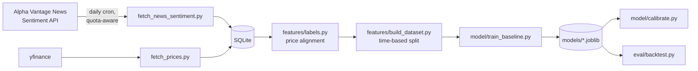

# Market Impact Predictor

Given a financial news event, predict the direction, magnitude, and
calibrated confidence of the stock price move that follows it. Builds on
[fin-event-intel](../fin-event-intel)'s event/entity extraction work, but
needs its own historical dataset — a live feed only teaches a model what
happens *after* you start running it, never what happened before.

## Highlights

- **Caught a costly wrong assumption about a third-party API before it
  compounded.** Assumed Alpha Vantage's multi-ticker query was an OR
  filter; it's actually an AND ("articles mentioning ALL listed tickers
  simultaneously"), which silently returned near-empty results and burned
  20 of a 25/day quota before the pattern was obvious enough to question.
  Redesigned around single-ticker calls once caught. ([details](#m1-lesson-verify-api-semantics-before-designing-around-them))
- **Every stage refuses to produce a misleading number on too little
  data**, rather than reporting a number that looks like a result but
  isn't one - verified on 15 examples (correctly refused to evaluate)
  and again on 31,230 (finally produced a real, honest result: the
  baseline doesn't beat buy-and-hold yet, see below).
- **Time-based train/test split, not random** — a random split on
  time-series financial data lets the model implicitly train on
  information from the future relative to a test example, which makes
  a backtest look better than any live version of the model ever could.
- **The backtest ships with its own caveats printed alongside the
  numbers** — no transaction costs, hand-picked ticker universe,
  single historical period — rather than a clean-looking result someone
  has to know to distrust.
- **22 tests, all deterministic, none needing a trained model or live
  API** — including one that caught a real bug in its own mock (a test
  double returning a Python list where the real dependency returns a
  numpy array, which broke the code's `[:, 1]` slicing).

## Architecture



Two independent data sources (news+sentiment, and raw prices) feed the
same SQLite database; `features/labels.py` is the join point that turns
"an article about ticker X at time T" into "what actually happened to
X's price afterward" - everything downstream (dataset construction,
training, calibration, backtest) is standard ML pipeline shape once that
join exists.

## Quickstart

```bash
python -m venv .venv
source .venv/bin/activate
pip install -r requirements.txt
cp .env.example .env   # then fill in ALPHA_VANTAGE_API_KEY
```

**Collect data** (news backfill is quota-limited to ~23 calls/day free
tier - runs incrementally, resumable, via a daily cron job):
```bash
python -m src.ingest.fetch_news_sentiment   # news + sentiment, quota-aware
python -m src.ingest.fetch_prices           # prices, no rate limit
```

**Run the modeling pipeline** (safe to re-run any time - picks up
whatever data exists):
```bash
python -m src.run_pipeline
```

## Testing

```bash
python -m pytest tests/ -v
```

22 tests, all fast (~1s total), all deterministic - no live API calls,
no trained model required. Same philosophy as Project 1: test the logic
you actually own directly (date/price arithmetic, the time-based split,
the quota tracker's persistence and reset behavior, the backtest's
position-sizing logic against a mocked model), and don't try to unit-test
a live model's output quality - that's what the manual verification
against real data (see below) and the eventual calibration/backtest
metrics are for.

## Roadmap

- [x] M0 — repo scaffold
- [~] M1 — historical news+sentiment ingestion (Alpha Vantage, quota-aware) — 6 of 21 tickers done (19,192 articles), rest still backfilling
- [x] M2a — historical price data (yfinance, 14mo × 21 tickers)
- [x] M2b — price alignment → forward-return labels
- [x] M3 — dataset construction (time-based split, no lookahead leakage)
- [x] M4 — baseline model — real result on 31,230 examples: doesn't beat the base rate yet (see below)
- [x] M5 — confidence calibration — real result: minimal improvement, consistent with M4's weak-signal finding
- [x] M6 — backtest evaluation — real result: underperforms buy-and-hold (35.07 vs 38.06)
- [x] M7 — portfolio polish (tests, README, this list)

## Engineering notes

The rest of this README is the build log - what was tried, what broke,
what got measured, and why. Kept chronological rather than rewritten as
if everything worked first try.

### M1 lesson: verify API semantics before designing around them

Alpha Vantage's `tickers` parameter looked like it should batch multiple
tickers per call (`tickers=AAPL,MSFT,...`) to conserve the 25-calls/day
quota. It doesn't work that way - per AV's own docs, it's an AND filter
("articles that simultaneously mention" every listed ticker), not an OR.
Batching 5 unrelated tickers together asks for articles mentioning all
5 at once, which almost never happens - the first backfill run burned
20 of that day's 25 calls returning near-zero results before this was
caught. Redesigned around one ticker per call, quarterly time windows
instead of monthly to keep the total call count reasonable (~84 calls
for a year across 21 tickers). Lesson kept for the interview, not just
here: verify an unfamiliar third-party API's actual semantics with one
cheap call before designing a whole strategy around an assumption.

Quota protection is two layers, not one: a local JSON counter tracks
calls used per UTC day, but every response is also checked for Alpha
Vantage's own rate-limit signal (a 200 OK with an "Information" or
"Note" field, not an HTTP error code) as a hard backstop - trusting only
local bookkeeping felt too fragile after already miscounting once.

The backfill runs via a real OS cron job (`crontab`, not a cloud-scheduled
task), since the script needs the project's local venv, `.env`, and
SQLite file - none of which a cloud sandbox would have access to.
Setting it up correctly took several tries: cron doesn't start in the
project directory, so a first attempt with relative paths would have
silently failed every day. Caught by testing the *exact* installed
crontab line from a cold `$HOME` shell before trusting it unattended,
after (embarrassingly) writing the same broken relative-path version
five times in a row via inline shell variables - switching to writing
the line to a file and reading it back is what actually broke that loop.

### M2b: market-hours cutoff for price alignment

An article published during market hours has its reaction reflected in
that same day's close; one published after close (or on a weekend/
holiday) can't be reacted to until the next session opens. Getting this
backwards would mean using a closing price that occurred *before* the
news broke as if it already reflected the market's response - a subtle
lookahead error, not just an off-by-one. The cutoff is a fixed ~20:00
UTC approximation of US market close, which doesn't precisely handle
the EST/EDT transition (off by up to an hour part of the year) - a
documented simplification, not a rigorous market-calendar implementation
(that would mean pulling in something like `pandas_market_calendars`).

### M4-M6, first run: too little data, and the pipeline said so

`scikit-learn` stalled four times installing on this machine (connection
established, then zero data movement for minutes) before finally
installing cleanly on a later attempt - real network flakiness that day,
not a code problem. Once it installed, `python -m src.run_pipeline` ran
M4 through M6 for the first time, on the 15 labeled examples that
existed at that point:

- **Direction classifier**: accuracy 0.667, but precision/recall/F1 all
  0.000 - the confusion matrix shows it predicted "down" for every
  single example. Not a bug: the model correctly found no real signal
  in 15 points and fell back to the majority class (10 of 15 were
  actually down).
- **Calibration (M5)** and **backtest (M6)** both correctly refused to
  run at all - 15 examples is below the 30-example minimum guard built
  into both, and each prints an explicit message saying so.

This confirmed the pipeline works exactly as designed - honest about
having too little data to say anything, rather than producing a
plausible-looking number regardless of sample size.

### M4-M6, the real run: 31,230 examples, and an honest negative result

The cron job set up to run the backfill daily never actually fired - the
laptop's boot log showed it powered on at 12:55pm, well after the 6am
scheduled time. Plain `cron` doesn't catch up on missed runs; it just
waits for the next scheduled time, which meant the "daily" backfill had
only run twice, both by hand during setup, not automatically overnight.

Running it manually once the day's quota had genuinely reset produced a
real surprise: every single API call returned the full 1,000-article cap.
Real per-ticker news volume is far higher than the ~150/quarter estimated
from one early test - one day's 23 calls (6 of 21 tickers) pulled in
19,192 articles and 62,511 ticker-sentiment pairs, versus the handful
that existed before.

That volume immediately exposed a real performance bug: `build_dataset()`
was calling `get_prices()` fresh for every row instead of once per
ticker, so 62k rows meant 62k separate database queries. It had been
fine at 15 rows and invisible until there was enough data to hurt -
caching each ticker's price series once and reusing it across its rows
took the build from "still running after several minutes" to 6.3 seconds.

With that fixed, `python -m src.run_pipeline` produced the first
real evaluation - 24,984 training examples, 6,246 held out for testing:

- **Direction classifier**: accuracy 0.565, recall 1.000, precision
  0.565 - the confusion matrix shows it predicted "up" for every single
  test example. Same majority-class collapse as the 15-example run, just
  the opposite direction (56.5% of this test period was actually "up") -
  with real volume behind it now, this is a genuine, not-yet-encouraging
  finding: three sentiment-only features don't carry enough linear
  signal to beat the base rate.
- **Calibration (M5)**: Brier score barely moved, 0.2460 → 0.2459.
  Consistent with M4's finding - calibration corrects a *miscalibrated*
  signal, and there's not much real signal here to correct.
- **Backtest (M6)**: strategy cumulative return 35.07 vs. buy-and-hold's
  38.06 on the same test examples. The strategy underperformed simply
  holding - trading on a weak, mostly-one-directional signal added noise
  without adding edge.

This is not the result I'd have picked to headline, and that's exactly
why it's the one worth keeping in the README rather than a cherry-picked
one. It's also a completely legitimate, expected place for a first
baseline to land: three off-the-shelf sentiment scores were never
guaranteed to contain a real trading signal, and now there's honest
evidence they mostly don't - not a guess, an actual measurement on 31k
examples with correct methodology behind it. That's precisely the
evidence needed to justify the next real investment (richer features,
starting with Project 1's own NER/event-classification output) instead
of shipping a baseline no one checked.

`reports/reliability_diagram.png` (from M5) plots predicted probability
against observed frequency for both the raw and calibrated model against
the perfect-calibration diagonal - added during M7 polish after noticing
`matplotlib` was installed but never actually used anywhere.

### First improvement pass: fixed a real failure mode, didn't fix accuracy

`src/model/train_improved.py` tests three changes against the baseline,
all using data already collected - feature scaling, `ticker` added as a
one-hot feature, class balancing, and a non-linear model
(`HistGradientBoosting`) - to see whether any of them turn the baseline's
weak result into a real one. Honest outcome, not the one I'd have picked
to headline:

| Config | Accuracy | F1 | What actually happened |
|---|---|---|---|
| Baseline (3 features, no scaling) | 0.565 | 0.722 | Predicted "up" for every single example - the accuracy number is just the base rate |
| + scaling + ticker | 0.554 | 0.664 | Real variation for the first time - both false negatives *and* true negatives are nonzero |
| + `class_weight="balanced"` | 0.457 | 0.495 | Worse than the base rate - forcing balance on a weak signal just adds noise |
| HistGradientBoosting instead | 0.545 | 0.657 | Statistically indistinguishable from plain logistic regression |

Raw accuracy technically *dropped* (0.565 → 0.554) - but the baseline's
0.565 came from a model that had stopped trying, predicting one class
regardless of input. The scaled+ticker version is the first one that's
actually discriminating between examples, which matters more than the
accuracy digit even though it's a less impressive-looking number.

Two things worth being able to say plainly, not just the numbers:
- **Class balancing is not automatically a good idea.** It's a common
  reflex fix for imbalanced data, and here it made results worse - with
  genuinely weak signal, forcing the classifier to split evenly just
  means it's guessing more symmetrically, not guessing better.
- **A stronger model did not fix a weak feature set.** Gradient boosting
  performed the same as logistic regression on the same 3 features. That's
  real evidence the bottleneck is the *information content* of the
  features, not the model's capacity to use them - which means the next
  real improvement is better features (Alpha Vantage's `topics` field is
  fetched and currently discarded; Project 1's own NER/event
  classification is unused here too), not a bigger model on the same
  three numbers.

Saved as `models/*_v2.joblib`, deliberately not overwriting the
production `direction_classifier.joblib` / `magnitude_regressor.joblib`
that `calibrate.py` and `backtest.py` load - this pipeline expects a
`ticker` column those don't pass yet, so wiring it in is a real next
step, not something to do silently as a side effect of running a
comparison script.

### Known limitations, stated plainly

- **Small, hand-picked ticker universe** (21 large, liquid, currently
  healthy companies across sectors) - not an unbiased trading universe;
  selecting it at all is a mild form of hindsight bias.
- **Daily price granularity only** - no intraday reaction captured,
  since free historical intraday data isn't available a year back.
  Meaningful for "does this news shift the multi-day trajectory," not
  for "how did the price move in the first five minutes."
- **Backtest has no transaction costs, slippage, or position sizing** -
  printed explicitly alongside every backtest run so the numbers are
  never read in isolation from that context.
- **Every quarterly news query hit Alpha Vantage's 1,000-article cap** -
  real volume per ticker is higher than that, and the fetch uses
  `sort=EARLIEST`, so each quarter's *later* articles for high-volume
  tickers are systematically missing, not randomly. A truer fetch would
  detect the cap being hit and split that window into smaller ones.
- **Confidence looks roughly reasonable but hasn't been rigorously
  checked** - the Brier score barely changed with calibration (0.2460 →
  0.2459), consistent with a model that doesn't have much real signal to
  calibrate in the first place. Worth re-checking once feature quality
  improves, not currently a claim that confidence is trustworthy.
- **The daily cron backfill silently never fired** - scheduled for 6am,
  but the laptop was off/asleep then, and plain `cron` doesn't catch up
  missed runs. Found via the boot log, not a smoking gun - worth moving
  to a trigger that survives a personal laptop's actual usage pattern
  (e.g. a systemd timer with `Persistent=true`, which runs a missed job
  as soon as the machine wakes) rather than assuming a laptop behaves
  like an always-on server.
